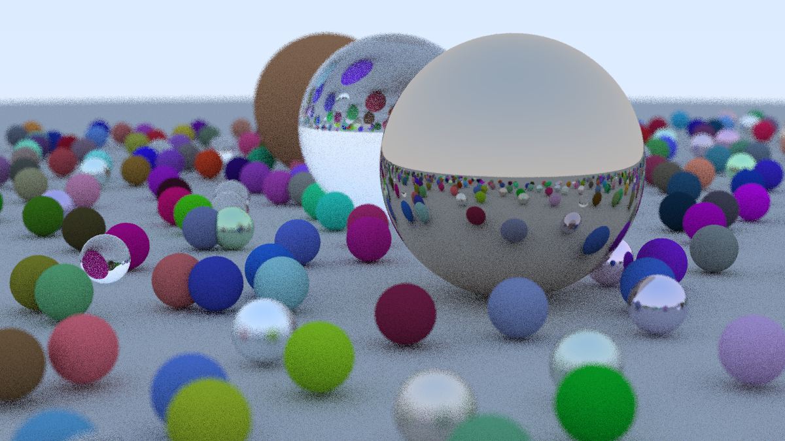

<h1 align="center">🌟 Ray Tracing Project</h1>

  
   
  <i>A simple ray tracing renderer built from scratch in C++.</i>

---

## 📖 Overview

This project provides a foundation for creating computer-generated images using ray tracing techniques. 
It implements a basic ray tracer that generates gradient images in <b>PPM format</b>. Ray tracing is a 
rendering technique that produces highly realistic lighting effects by simulating the physical behavior of light.

---

## 🎨 Current Features
<ul>
  <li>🖼️ Output in <b>PPM (Portable Pixmap)</b> format</li>
  <li>📏 Configurable image dimensions</li>
</ul>

---

## 🛠️ Prerequisites
<ul>
  <li>🔹 C++ compiler (<code>g++</code> or <code>clang++</code>)</li>
  <li>🔹 CMake</li>
  <li>🔹 Image viewer that supports PPM format or a converter</li>
</ul>

---

## 🚀 Clone the Repository
<pre>
git clone https://github.com/pmschz/RayTracing.git
cd RayTracing
</pre>

---

## 🔨 Build using CMake
<pre>
mkdir build
cd build
cmake ..
make
</pre>

---

## 🖥️ Run the Ray Tracer
<pre>
g++ -std=c++11 src/main.cc -o main && ./main > image.ppm
</pre>

---

## 🖼️ To View Output on Mac
<pre>
open output.ppm
</pre>

## ⭐ Contributing & Feedback

If you have suggestions or want to contribute, feel free to open an issue or pull request!

📩 <b>Connect with me:</b>  
🔗 <a href="https://github.com/pmschz"><b>GitHub</b></a>  
🔗 <a href="https://www.linkedin.com/in/paulinasanchez177/"><b>LinkedIn</b></a>  

---

